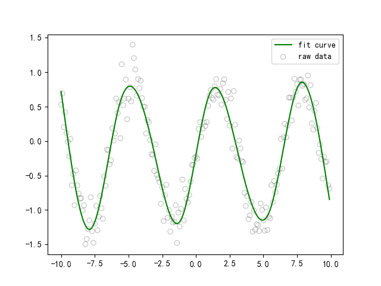
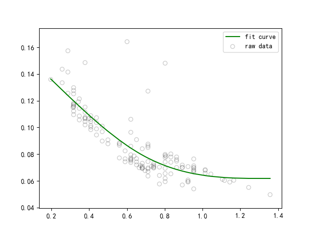
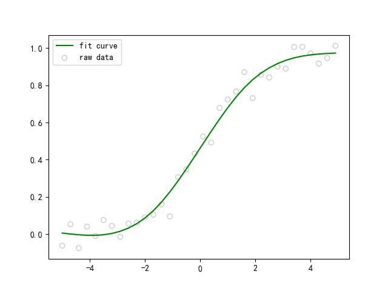

# curve_fit
Fit curve with regression splines.
- [x] continuous functions
- [ ] discontinuous functions

Install
========
```
pip install curve_fit
```

Usage
========
```
from curve_fit import continuous
import numpy as np

x = np.arange(-10, 10, 0.1)
noise = np.random.normal(-0.1, 0.1, len(x))
y = np.sin(x) + noise

# k: complexity, defaultk=3
c = continuous.Continuous(k=10)
model = c.fit(x, y)
pred = model.predict(x)
```

Example
========
**sin: k=10** 


**exp: k=3** 


**sigmoid: k=4** 

